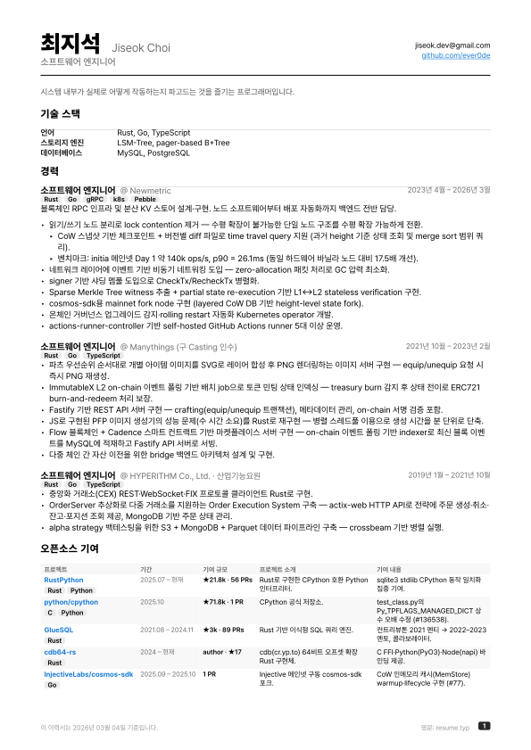
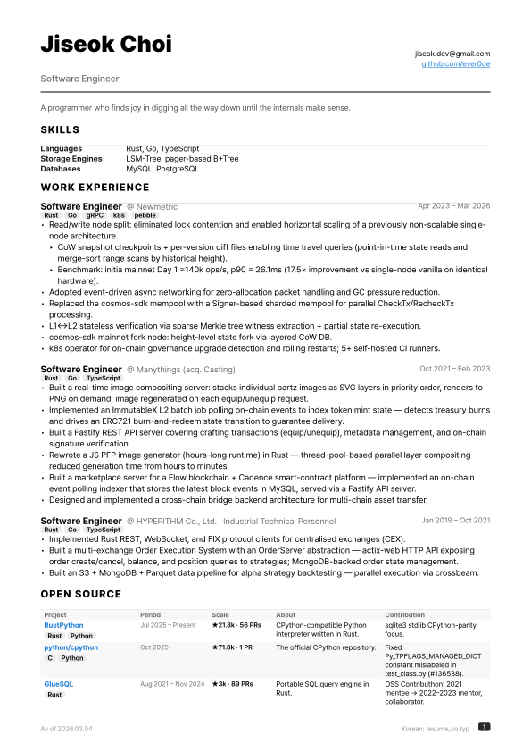
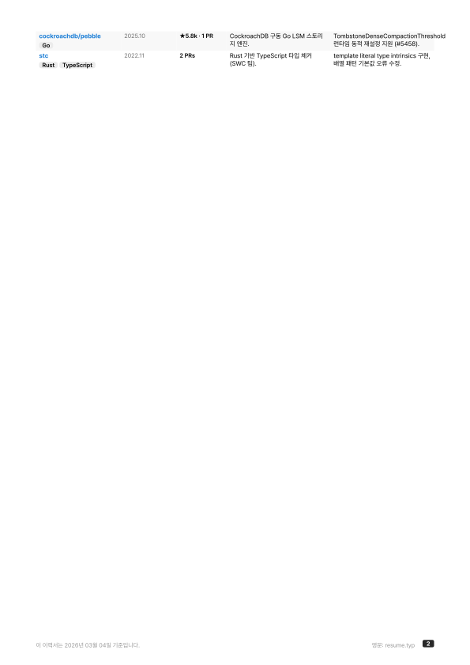
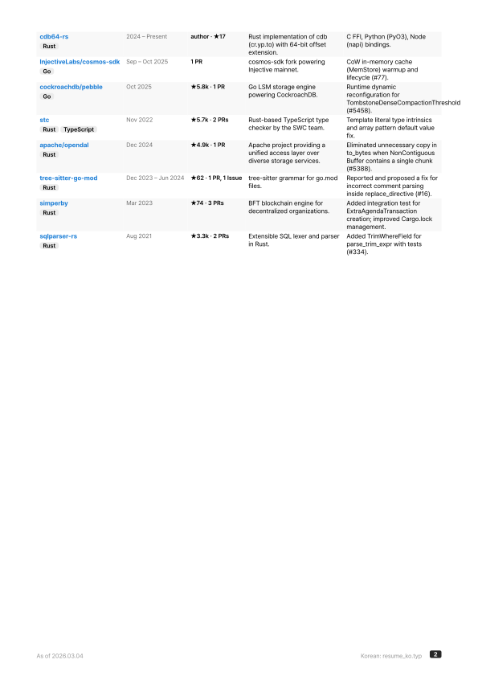

# 최지석 이력서 / Jiseok Choi — Résumé

<table>
<tr>
<td><b>국문</b></td>
<td><b>English</b></td>
</tr>
<tr>
<td></td>
<td></td>
</tr>
<tr>
<td></td>
<td></td>
</tr>
</table>

## 빌드

```sh
# SVG for multi-page output (adds page number into filename)
typst compile resume_ko.typ "resume_ko_{p}.svg"
typst compile resume.typ "resume_{p}.svg"

# or produce single-file PDF
typst compile resume_ko.typ
typst compile resume.typ
```
