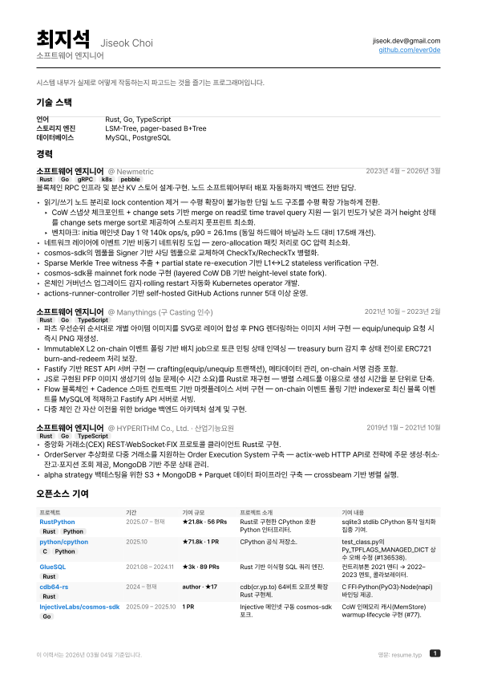
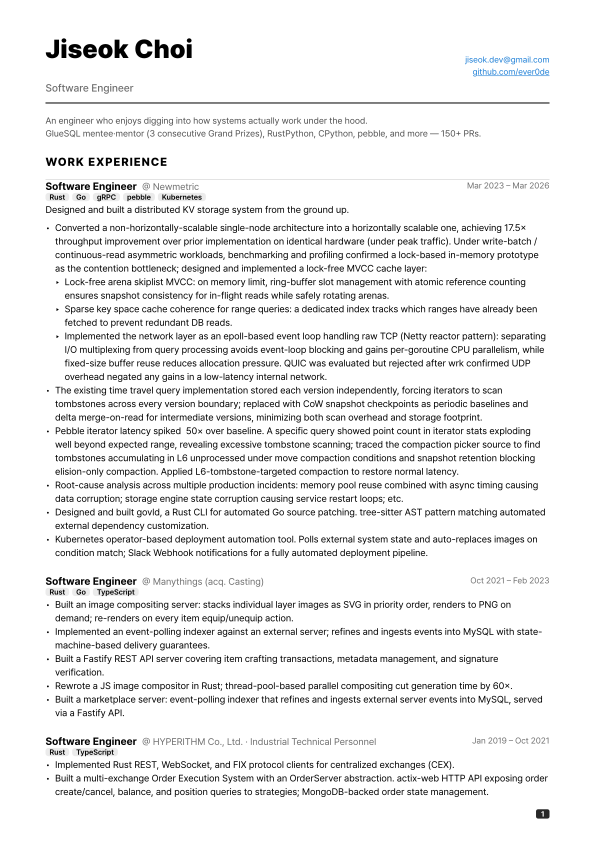
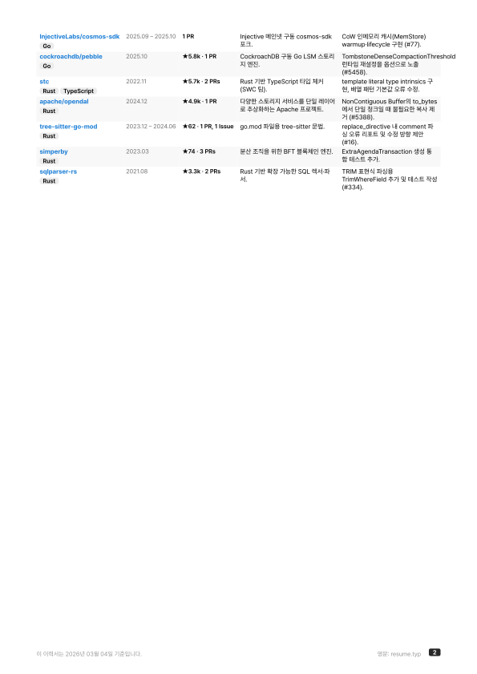

# 최지석 이력서 / Jiseok Choi — Résumé

> **모바일 사용자**: [국문 PDF](./output/resume_ko.pdf) · [English PDF](./output/resume.pdf)

## Preview

| 국문 | English |
|------|---------|
|  |  |
|  |  |

## Newmetric 관련 공개 가능한 문서

| 파일 | 내용 |
|------|------|
| [public/newmetric/cache/README.md](public/newmetric/cache/) | Cosmos SDK RPC Scale-out을 위한 Stateless In-Memory Cache 설계·구현 — MVCC Arena Skiplist, 3슬롯 Ring Buffer + Arc Ref Counting, Range History, CoW Interval Tree 탐구 |
| [public/newmetric/pebble/multi-version-snapshot-research.md](public/newmetric/pebble/multi-version-snapshot-research.md) | Pebble 위에 MVCC를 얹은 cosmos-sdk KV 스토어에서 tombstone 키 누적으로 인한 반복자 성능 저하 문제 분석 — Key/Archive 이중 테이블, MVCC Comparer, CoW BTree 등 스키마별 트레이드오프 탐구 |
| [public/newmetric/pebble/](public/newmetric/pebble/) | Pebble LSM-tree의 compaction 전략(move compaction, elision-only compaction, compensated size) 분석 — tombstone이 L5/L6에 누적되어 iterator 성능이 저하되는 문제를 디버깅하고 해결한 과정 |
| [public/newmetric/postmortem/README.md](public/newmetric/postmortem/) | 2023-10 ~ 2025-02 블록체인 인프라 운영 중 발생한 장애 대응 사례 |
| [public/newmetric/study/](public/newmetric/study/) | 팀원에게 Rust를 설명할때 작성한 문서 |

```sh
# SVG (multi-page output)
typst compile resume_ko.typ "output/resume_ko_{p}.svg"
typst compile resume.typ "output/resume_{p}.svg"

# PDF
typst compile resume_ko.typ output/resume_ko.pdf
typst compile resume.typ output/resume.pdf
```
