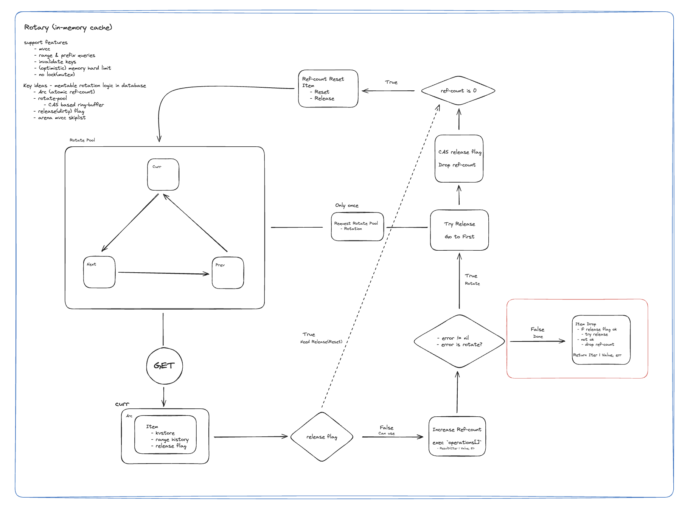

# Stateless In-Memory Cache — Cosmos SDK 기반 블록체인 RPC Scale-out 문제 해결

> 본 문서는 공개된 기술 레퍼런스와 직접 수행한 분석·실험을 토대로 작성되었으며, 회사의 기밀정보나 영업비밀을 포함하지 않습니다.

| 항목 | 내용 |
|------|------|
| **회사** | Newmetric |
| **언어** | Go |
| **역할** | 리서치·설계·구현 |

---

## 배경 및 문제 정의

B2B SaaS 형태로 여러 체인의 RPC 엔드포인트를 제공하는 서비스를 운영하면서, 특정 체인에 예측 불가능한 트래픽 스파이크가 발생하는 문제를 겪었습니다.

구조적인 문제는 Cosmos SDK에 있었습니다. Cosmos SDK v0.46 이전에서 사용하던 Tendermint의 ABCI 클라이언트([`local_client.go`](https://github.com/tendermint/tendermint/blob/v0.35.0/abci/client/local_client.go#L15-L21))는 단일 `*tmsync.Mutex`를 공유해, ABCI 처리·RPC 쿼리·CheckTx 등 모든 작업을 **전역 뮤텍스(global mutex)** 로 직렬화하고 있었습니다. 이 때문에 블록 실행 중에는 RPC 전체가 블로킹되고, 하나의 RPC 요청이 오래 걸리면 그 시간 동안 아무것도 처리하지 못했습니다.
또한 기존 구조로는 scale-out을 위해 노드를 추가하려면 최신 snapshot이 필요했기 때문에, hot standby 노드를 준비해도 갑작스러운 CPU spike에 즉각 대응하는 horizontal scale-out은 사실상 불가능했습니다. 최신 state snapshot은 체인에 따라 10 GB 내외에 달하기도 하여, 유연한 scale-out을 위해 복수의 노드를 미리 준비해두는 것은 인프라 비용 측면에서도 큰 부담이었습니다.

핵심은 **블록체인 RPC의 트래픽 특성**이었습니다. read 쓰루풋은 매우 높지만, write는 블록 생성 주기(`height`)마다 한 번씩 batch로 발생하는 구조였습니다. write 워크로드(블록 실행·합의)와 read 워크로드(RPC)를 완전히 분리하고, **stateless cache 레이어**를 별도로 구성하면 캐시 노드만 scale-out해서 RPC를 처리할 수 있다는 아이디어로부터 시작했습니다.

---

## 1차 시도: RwLock 기반 BTree In-Memory KV Store

[google/btree](https://github.com/google/btree)를 기반으로 `sync.RWMutex`를 씌운 단순한 in-memory KV store를 먼저 구현했습니다. k6로 **프로덕션 트래픽 분포를 재현**한 stress 테스트를 수행한 결과, 두 가지 병목이 명확히 드러났습니다.

- **Write lock 동안 모든 read가 블로킹**: `height`마다 새 블록이 커밋되는 순간 write lock을 잡으면, 그 시점에 대기 중인 read goroutine이 전부 멈추는 구간적 지연이 발생했습니다.

pprof로 측정해보면 mutex blocking이 지배적으로 나타났고, 결론적으로 **하드웨어 병렬성을 제대로 활용하지 못하는 구조**라는 판단 하에 lock-free 방향으로 전환했습니다.

---



## 2차 시도: MVCC Arena Skiplist — Lock-free In-Memory KV Cache

블록체인의 `height`는 단조증가하는 강력한 global logical clock입니다. 이 특성을 활용하면 write 시 lock을 잡는 대신 MVCC(Multi-Version Concurrency Control) 방식으로 버전을 나눠 읽고 쓸 수 있습니다. arena 기반 lock-free skiplist를 활용해 **iterator를 지원하는 in-memory KV cache**를 구현했습니다. arena 할당 방식은 개별 노드마다 별도의 메모리를 할당하지 않고 미리 확보한 연속 메모리 블록에서 순차 할당하므로, 최대한 GC 압박 없이 작동하도록 구현하였습니다.

---

## Arena Full 문제: 3슬롯 Ring Buffer + Arc Reference Counting

arena 방식의 본질적인 한계는 메모리가 꽉 차면(`ArenaFull`) 더 이상 쓸 수 없다는 점입니다. 단순히 즉시 리셋하면 살아있는 iterator가 댕글링 포인터를 참조하는 문제가 생깁니다.

이를 해결하기 위해 **3슬롯 Rotary Pool**을 설계했습니다.

```
[Next] → [Current] → [Previous]
  ↑                       |
  └───────────────────────┘  (rotation)
```

- **Current**: 현재 read/write 요청을 서빙하는 멤테이블
- **Next**: 이미 리셋이 완료되어 다음 rotation 대기 중인 멤테이블
- **Previous**: rotation 직후 아직 살아있는 long-lived iterator들이 참조 중인 멤테이블

각 슬롯은 **Arc(Atomic Reference Counting)** 포인터로 감싸, ref count가 0이 되는 순간 arena를 안전하게 리셋합니다. `ArenaFull` 발생 시 CAS(Compare-And-Swap)로 슬롯을 교체하고, GC 고루틴이 ref count를 모니터링하며 안전한 시점에 리셋을 수행합니다. 이 설계를 통해 **no mutex, lock-free**로 메모리 상한을 지키면서도 iterator consistency를 보장했습니다.

메모리 상한은 설정 가능하며, arena가 가득 찰 경우 회전이 발생하고, 별도로 설정 가능한 임계값을 초과하는 요청은 캐시를 우회해 마스터 DB에서 직접 fetch하도록 구성하여 OOM 없이 메모리를 예측 가능하게 유지했습니다.

---

## Range Query 문제: Arena Skiplist 기반 Range History

일반적인 캐시 레이어에서 단순 `Get` 요청은 hit/miss 상태를 키 단위로 관리하면 충분합니다. 하지만 **Iterator(range/prefix query)** 를 지원하려면 복잡한 문제가 생깁니다.

예를 들어 `exchange/{address}/{coin_address}` 형태의 key 스페이스를 생각해 보면, 실제 DB에는 `[1, 10, 99]`처럼 **sparse하게** 키가 존재합니다. 클라이언트가 `[1, 100)` 범위를 요청했을 때, 캐시에 `1`과 `10`이 있다고 해서 `[1, 100)` 범위 전체가 캐시에 있다고 볼 수 없습니다—`[11, 99]` 사이에 DB에서 아직 가져오지 않은 키가 있을 수 있기 때문입니다.
따라서 **"이 구간 `[start, end)`의 데이터를 마스터 DB에서 이미 가져왔다"는 메타데이터**를 별도로 추적해야 합니다.

**Range History**를 별도의 arenaskl 기반 skiplist로 구현했습니다. 설계 포인트는 간단합니다.

- skiplist의 **key = range end**, **value = range start**로 저장
- `Include(start, end)` 쿼리 시 `SeekGE(start)` + `Next()`으로 O(log N + K) 포함 여부 판별
- 겹치는 range(`[a,d)` + `[b,e)`)는 쿼리 시점에 `min(start), max(end)`로 merge

---

## 리서치: Copy-on-Write Interval Tree + Atomic Pointer Swap

Range History에서 read-heavy 워크로드라는 점을 고려해, range 병합을 쿼리 시점이 아닌 **삽입 시점에** 미리 수행하는 방향을 검토했습니다. 삽입 시 겹치는 범위를 병합할 수 있는 자료구조나 방법론을 찾다가 **Interval Tree**에 도달했습니다.

Interval Tree를 적용해보니 RwLock 기반으로 구현하면 처음의 BTree와 같은 contention 문제가 재발했습니다. 이를 해결하기 위해 [`tidwall/btree`](https://github.com/tidwall/btree)의 **Copy-on-Write** 구현에서 힌트를 얻었습니다. tidwall/btree는 각 노드에 `isoid uint64`(단조증가 ID)를 부여하고, write 시 노드의 `isoid`와 현재 트리의 `isoid`를 비교해(`(*cn).isoid != tr.isoid`) 다르면 해당 노드를 복사(clone)한 뒤 수정합니다.

이를 Interval Tree에 적용하고, 두 개의 트리(`read tree`, `write tree`)를 `atomic.Pointer`로 관리하는 방식을 고안했습니다.

- **Read**: `atomic.Pointer.Load()`로 read tree를 lock 없이 참조
- **Write**: write tree에 CoW로 수정 후, 완료되면 `atomic.Pointer.CompareAndSwap()`으로 read tree와 교체

실제 구현과 벤치마크까지 진행했으나, B2B 계약 기간 만료로 프로덕션 배포 전 단계에서 프로젝트가 마무리되었습니다.

---

## 품질 관리: 릴리즈별 Regression Benchmark

중요 배포마다 k6로 stress 테스트(`vus=500`, `duration=10s`)를 수동으로 실행해 이전 버전 대비 성능 회귀(regression)가 없는지 확인했습니다. 이 과정을 통해 각 최적화 단계의 실제 효과를 수치로 검증하고, 예상치 못한 성능 저하를 사전에 차단했습니다.

---

## 성과

**Injective DevCon 2024 발표 기준** ([발표 영상](https://www.youtube.com/watch?v=7IOwKMxFqyg)):

| 항목 | 기존 (vanilla Injective 노드) | Newmetric Edge 노드 (1 replica) |
|------|------|------|
| 하드웨어 | 16c / 64 GiB | **2c / 2 GiB** + remote DB 1c/4g |
| Throughput | 530 req/s | **7,531 req/s** |
| p95 Latency | 913 ms | **95 ms** |
| 수평 확장 | 사실상 불가 (snapshot 필요) | **replica 수에 비례해 선형 확장** |

사용 하드웨어를 1/8 수준으로 줄이면서 처리량은 약 **14배** 향상됐습니다.

---

## 결론

| 단계 | 상태 | 비고 |
|------|------|------|
| RwLock BTree KV Store | 구현 완료 · 성능 한계 확인 | mutex blocking이 지배적 — lock-free로 방향 전환 |
| MVCC Arena Skiplist (lock-free in-memory KV cache) | **프로덕션 배포** | height를 버전으로 활용, 읽기 경합 제거 |
| 3슬롯 Ring Buffer + Arc Ref Counting | **프로덕션 배포** | arena safe rotation 달성, no-mutex, 2GB 상한 |
| Range History (arenaskl 기반 skiplist) | **프로덕션 배포** | O(log N) range 포함 판별, prefix query 지원 |
| CoW Interval Tree + Atomic Pointer Swap | 구현·벤치마크 완료 · 미배포 | 재직 기간 내 프로덕션 반영 전 종료 |

블록체인의 단조증가 `height`를 MVCC 버전으로 재해석하면, write 시 lock 없이 다중 버전 읽기가 가능하고 arena를 안전하게 순환시킬 수 있습니다.
