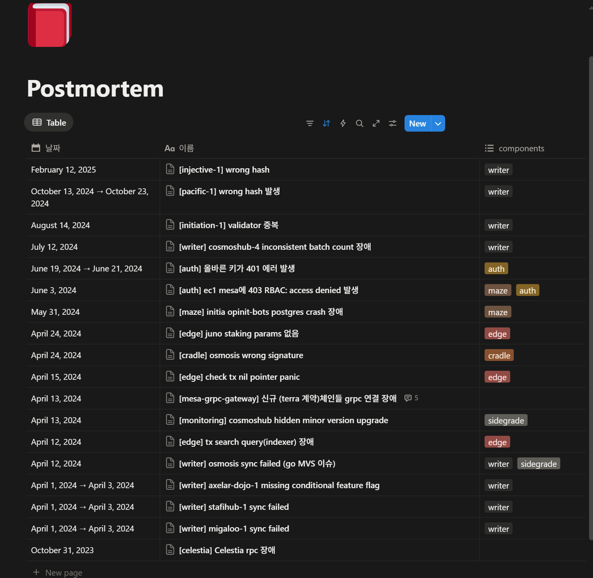
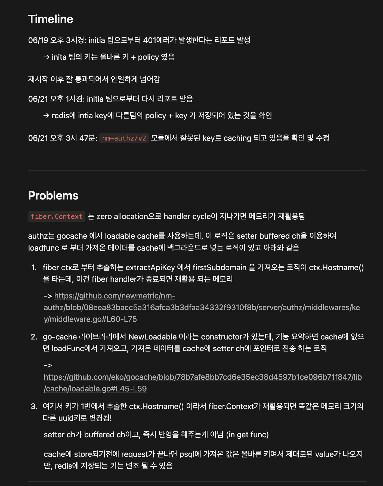
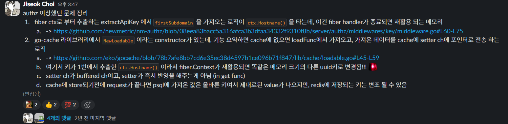
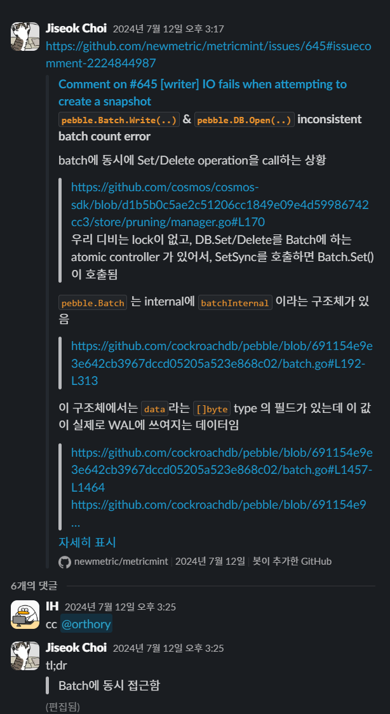
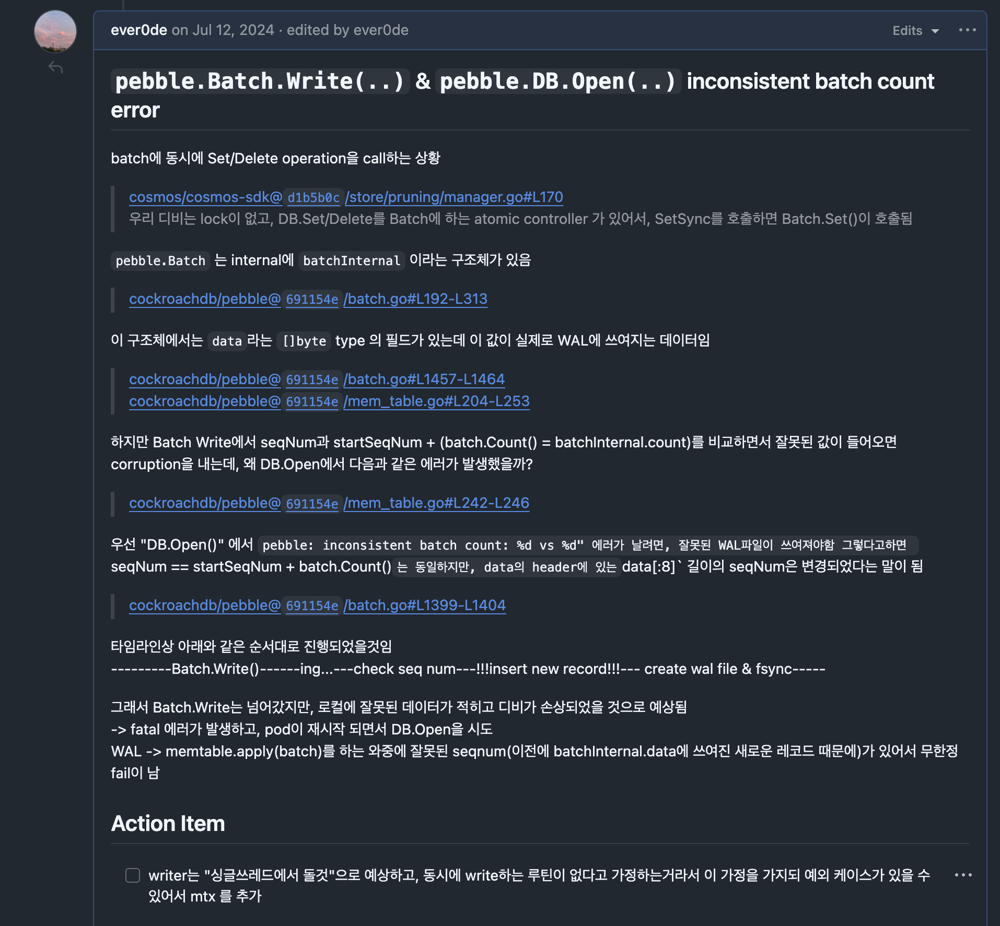
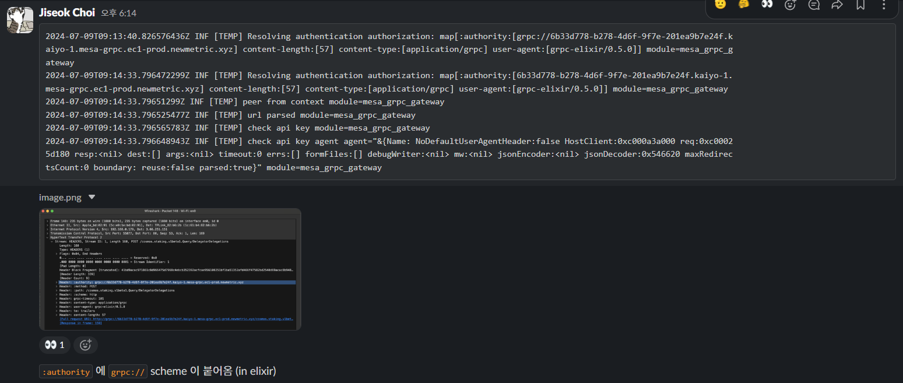

# Newmetric Postmortem & 문제 분석 기록

> 본 문서는 공개된 기술 레퍼런스와 직접 수행한 분석·실험을 토대로 작성되었으며, 회사의 기밀정보나 영업비밀을 포함하지 않습니다.

Newmetric에서 분산 KV 스토리지 서비스 운영 중 발생한 장애 대응 및 문제 해결 사례 모음.

> 기간: 2023-10 ~ 2025-02

---

## 목차

1. [장애 대응 이력 Overview](#1-장애-대응-이력-overview)
2. [Fiber Context 메모리 재사용으로 인한 캐시 키 변조](#2-fiber-context-메모리-재사용으로-인한-캐시-키-변조)
3. [Pebble Batch Race Condition](#3-pebble-batch-race-condition)
4. [gRPC `:authority` Header Bug](#4-grpc-authority-header-bug)
5. [gRPC TLS/ALPN 협상 실패](#5-grpc-tlsalpn-협상-실패)

---

## 1. 장애 대응 이력 Overview



2023-10 ~ 2025-02 동안 분산 스토리지 서비스 운영 중 발생한 약 18건의 장애 이력.

### 주요 장애 유형

| 유형 | 사례 |
|------|------|
| **데이터 정합성** | wrong hash, wrong signature, inconsistent batch count |
| **환경/설정** | missing feature flag, hidden minor version upgrade, Go MVS 이슈 |
| **런타임 에러** | nil pointer panic, postgres crash |
| **네트워크/프로토콜** | gRPC 연결 장애, RPC 장애 |

---

## 2. Fiber Context 메모리 재사용으로 인한 캐시 키 변조




### 현상

- 인증/인가 모듈에서 특정 고객의 API 호출 시 **401 Unauthorized** 간헐 발생
- PostgreSQL에서 가져온 값은 정상이나, Redis 캐시에 저장되는 키가 **다른 팀의 UUID로 변조**되어 잘못된 정책(Policy)이 매핑됨

### 타임라인

| 시점 | 내용 |
|------|------|
| 06/19 15:00 | 고객으로부터 401 에러 리포트. 키/정책 정상 확인, 재시작 후 정상화되어 일시적 현상으로 판단 |
| 06/21 13:00 | 동일 리포트 재발. Redis에 해당 고객 키에 타 고객 정보가 저장된 것을 확인 |
| 06/21 15:47 | 캐시 키 변조 버그 확인 및 수정 완료 |

### 근본 원인

Fiber 프레임워크의 **zero-allocation 메모리 재사용**과 `eko/gocache`의 **비동기 setter 채널** 간 Race Condition.

1. **키 추출**: 미들웨어에서 `ctx.Hostname()`으로 subdomain(고객 UUID)을 캐시 키로 사용
2. **캐시 로드**: `NewLoadable`의 `loadFunc`으로 캐시 미스 시 PostgreSQL에서 데이터 획득 — 이 시점에는 `ctx.Hostname()` 값 유효
3. **비동기 저장**: 획득한 데이터를 `setter` **buffered channel**을 통해 백그라운드에서 Redis에 저장
4. **메모리 반환**: 응답 전송 후 핸들러 종료 → Fiber가 `ctx` 객체를 메모리 풀에 반환, 다음 요청에 재할당
5. **키 변조**: `setter` 채널이 실제 저장을 수행하는 시점에는 `ctx.Hostname()`이 가리키던 메모리가 **새로운 요청의 UUID로 덮어씌워짐** → 잘못된 키로 Redis에 캐시 저장

### 해결

`ctx.Hostname()` 반환값을 핸들러 내에서 **즉시 새로운 문자열로 복사(deep copy)** 하여 캐시 키로 사용. 핸들러 생명주기 이후에도 값 불변성 보장.

---

## 3. Pebble Batch Race Condition




### 배경

기존 구현에서는 내부 처리가 **싱글 스레드 순차 실행** 방식으로 설계되어 있었다. 그런데 의존 라이브러리 버전이 업그레이드되면서 특정 작업이 goroutine으로 비동기 실행되도록 변경되었고, 이로 인해 기존의 싱글 스레드 전제가 깨졌다.

### 현상

- `pebble.Batch.Write()` 및 `pebble.DB.Open()` 호출 시 **inconsistent batch count error** 발생
- 런타임 중 데이터 모순이 발견되어 **Fatal Error → Pod 종료**
- 재시작 시 WAL 복구 과정에서도 오염된 데이터로 인해 DB Open 실패 → **무한 재시작 루프(Infinite Fail Loop)**

### 근본 원인

`pebble.Batch`는 **thread-safe하지 않음**. 기존에는 싱글 스레드로만 접근되어 lock 없이 동작했으나, SDK 버전 업그레이드로 비동기 스냅샷 goroutine이 추가되면서 여러 goroutine이 동시에 `Batch.Set/Delete`를 호출하게 됨.

1. **데이터 오염**: `Batch.Write()` 진행 중 다른 goroutine이 `Set/Delete`를 호출하면 내부 `data []byte` 버퍼와 레코드 카운트(`count`)가 불일치
2. **WAL 오염**: `data[:8]`에 저장되는 시퀀스 넘버 헤더가 쓰기 도중 수정되어, 오염된 상태로 `fsync` 완료
3. **복구 불가**: Pod 재시작 시 `pebble.DB.Open()`에서 WAL을 읽어 Memtable에 복구 시도 → 오염된 헤더와 실제 레코드 수 불일치 → `pebble: inconsistent batch count` 에러로 DB Open 실패

### 해결

싱글 스레드 전제를 폐기하고, `Batch` 객체 접근 시 **Mutex**를 추가하여 상호 배제 보장.

---

## 4. gRPC `:authority` Header Bug



### 현상

- Elixir 기반 gRPC 클라이언트(`grpc-elixir/0.5.0`)가 `:authority` 헤더에 `grpc://` 스킴을 접두어로 포함하여 전송
- 정상 기대값: `host:port` → 실제 전달값: `grpc://host:port`
- gRPC 게이트웨이에서 인증 처리 시 파싱 실패

### 분석 방법

1. **서버 로그 분석**: gRPC 게이트웨이에서 `:authority` 필드에 `grpc://` 문자열 포함 확인
2. **Wireshark 패킷 캡처**: HTTP/2 프레임에서 `:authority` 헤더에 스킴이 중복 포함된 규격 위반 교차 검증
3. **Elixir 재현 코드**: gRPC 인터셉터로 raw response 확인

### 재현

Elixir `grpc-elixir` 라이브러리가 `:authority`에 `grpc://` 스킴을 붙이는 것을 재현하기 위해 별도 프로젝트 작성.

- `GRPC.ClientInterceptor`를 구현한 커스텀 인터셉터로 raw gRPC response를 캡처하여 헤더 확인
- gRPC 서버에 테스트 RPC를 호출하면서 `:authority` 헤더에 수동으로 값을 삽입해 동작 비교
- 결과: `grpc-elixir`의 `scheme: "grpc"` 옵션이 `:authority`에 스킴을 접두어로 붙이는 것을 확인

### 해결

gRPC 게이트웨이의 인증 미들웨어에서 `:authority` 헤더로부터 고객 UUID(첫 번째 subdomain)를 추출하는 로직에, `"://"` 기준으로 split하여 scheme이 포함되어 있으면 strip하는 처리를 추가.

```go
// before: host가 "grpc://uuid.chain.example.com"이면
// Split(host, ".")[0] → "grpc://uuid" → UUID parse 실패
firstSubdomain := strings.Split(host, ".")[0]

// after: scheme 존재 여부를 먼저 확인하고 제거
splitHosts := strings.Split(host, "://")
if len(splitHosts) > 1 {
    host = splitHosts[1]
}
firstSubdomain := strings.Split(host, ".")[0]
```

---

## 5. gRPC TLS/ALPN 협상 실패

### 현상

- 고객이 Python gRPC 클라이언트로 gRPC 엔드포인트에 TLS 연결 시 통신 실패
- `openssl s_client -alpn h2`로 확인 결과 **"No ALPN negotiated"** — HTTP/2 ALPN 협상이 이루어지지 않음

### 분석 방법

- Python(`cosmpy` + `grpc`)으로 `ssl_channel_credentials`를 통한 secure channel 연결을 재현
- `openssl s_client`로 TLS 핸드셰이크 시 ALPN 프로토콜 협상 결과를 직접 확인

### 재현

```shell
openssl s_client -connect <endpoint>:443 -alpn h2 | grep ALPN
# No ALPN negotiated
```

### 해결

TLS 종단(로드밸런서/프록시)에서 HTTP/2 ALPN 프로토콜을 지원하도록 설정 수정.
